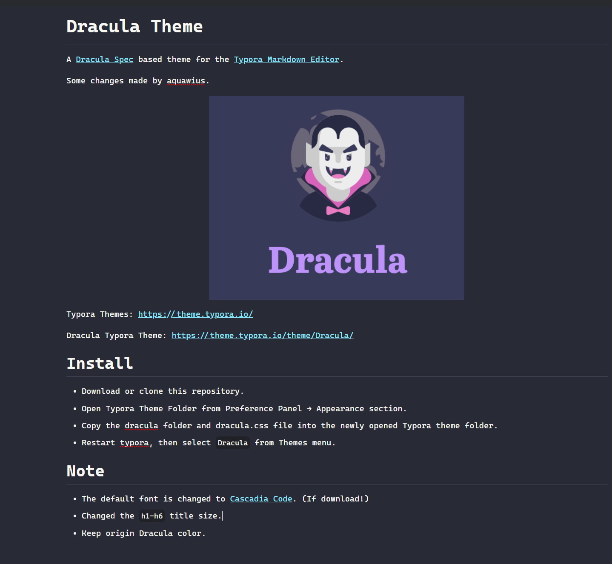

# Dracula Theme

A [Dracula Spec](https://draculatheme.com) based theme for the [Typora Markdown Editor](https://typora.io).

Some changes made by aquawius.

Typora Themes: https://theme.typora.io/

Dracula Typora Theme: https://theme.typora.io/theme/Dracula/

## Install

* Download or clone this repository.
* Open Typora Theme Folder from Preference Panel → Appearance section.
* Copy the dracula folder and dracula.css file into the newly opened Typora theme folder.
* Restart typora, then select `Dracula` from Themes menu.

## Screen shot

## Note

- The default font is changed to [Cascadia Code](https://github.com/microsoft/cascadia-code). (If download!)
- Changed the `h1-h6` title size.
- Keep origin Dracula color.
